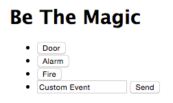

# Hz-test-1
This is a bare-bones project demonstrating the ease that is websocket programming with node.js and socket.io.

One page acts as the wall warts equipped with microphones sending data to the hub via the ZigBee network.


The other page acts as a device (whether tablet, smartphone, desktop) capable of receiving real-time "push notifications" about the magic events.


Installation
============

```git clone https://github.com/JimiHFord/Hz-test-1.git```

```cd Hz-test-1/```

If you don't have node.js installed... shame on you. [Get node!](https://nodejs.org/) npm stands for node package manager and will automatically be installed with the previously cited link. Until you do that, the following commands will not work.

```npm install```


run ./bin/www

Visit "localhost:3000" in browser. Also open 129.xxx.xxx.xxx:3000 (whoever is hosting the application) on a smartphone or laptop for additional satisfaction. (If you have a firewall running, you have to either open incoming connections on port 3000 or just turn the firewall off.)
